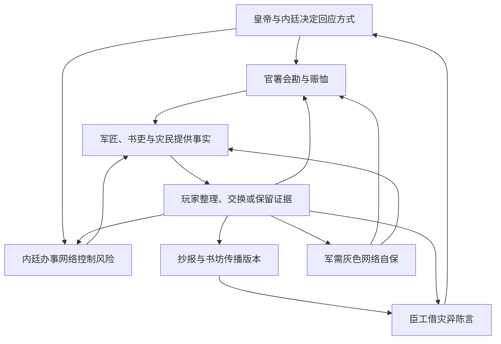

# 《天变邸抄：五月初六》势力设计 v0.1

> 状态：主线结构设计，不是人物定稿  
> 更新日期：2026-08-03  
> 上位文档：[叙事概念](./TIANQI_STORY_CONCEPT.md)  
> 史料边界：[史料与研究索引](../research/tianqi/SOURCES.md)

## 1. 设计目标

本作的政治结构分为两层：

- **真实权力层**通过谕旨、奏疏、会勘、赈恤和查禁改变游戏规则；
- **虚构行动层**负责接触玩家、争夺证据、保护或威胁证人，并承担具体戏剧行为。

真实大人物不是站在地图上反复发布任务的 NPC。他们的一道谕旨或一份奏疏，应该同时改变三个以上势力的行动，而不是增加一段背景对白。

## 2. 真实权力节点

以下人物可以进入游戏，但只使用经史料支持的公共行为。具体日期在游戏中会压缩；引用见 [S01][S03][S07]。

### 2.1 明熹宗朱由校

**历史锚点：**灾后下令查勘、修省、停刑、禁屠，祭告太庙，并对臣工关于刑狱、殿工和朝政的陈言作出回应。

**游戏功能：**皇帝不直接给玩家任务，而是发布三次全局命令：

1. 查勘救火与封锁灾区；
2. 发银优恤并要求建立可核发的灾损名册；
3. 要求修省，但随后反对臣工把一切责任归于君上。

这三次命令分别改变探索权限、名册价值和政治言论风险。

### 2.2 内阁首辅顾秉谦

**历史锚点：**参与灾后自劾，并借修省讨论停刑；其奏疏与随后官员陈言共同构成灾异政治化的开端。

**游戏功能：**以公开奏疏存在，不虚构其私下联系玩家。他的文本使“刑狱是否失当”成为官方可讨论的问题，也让内廷办事者开始追查是谁向臣工提供灾区材料。

### 2.3 兵部尚书王永光

**历史锚点：**上疏认为形式化修省不足，涉及刑狱、边事、吏治、殿工和票拟等现实问题；后续陈言加剧君臣分歧。[S01][S07]

**游戏功能：**他的奏疏是第二幕的政治转折。玩家不能操纵他，但玩家掌握的军需材料可能被虚构的陈言网络摘录，使一场仓储调查变成关于朝政的争论。

### 2.4 魏忠贤

**历史锚点：**天启六年处于权力高峰，厂卫政治和诏狱构成灾变发生时的重要背景。[S05][S07]

**使用限制：**当前资料不足以支持“魏忠贤直接主持灾后掩盖或灭证”。游戏不让他发布虚构灭口命令，也不让玩家与其秘密会面。

**游戏功能：**他的存在是一种“上意如何被揣摩”的压力。虚构内廷人员可能为了自保主动压制某些说法，也可能误判真正需要被控制的内容。

### 2.5 李灿然及相关查灾官员

**历史锚点：**史料保存了灾损房屋、死者和优恤银分配的行政统计，并涉及无名死者收埋与祭议。[S01]

**游戏功能：**官方统计不是系统真值，而是一份会被材料、期限和行政资格影响的“官册”。真实官员只以公文和批示出现，实际登记工作由虚构书吏执行。

## 3. 六个可交互势力

### 3.1 联合会勘官署 `FCT_INQUEST`

**公开目标：**查明灾损、清理厂区、收拢军器、形成可上报的灾情与责任说明。

**隐藏矛盾：**工部需要解释厂区管理，兵部关注京营供应，都察院关注查勘与纠察；合作是奉旨要求，互相保留责任边界则是各自本能。

**主要资源：**现场封锁权、官册、库房钥匙、差役、验伤与移文权限。

**最害怕的事：**调查长期无法闭合，使“失慎事故”扩大为整个军需制度问题。

**红线：**玩家公开尚未会勘的军器文书、妨碍搬运军器，或使一名受保护官员直接成为舆论焦点。

**默认行动链：**

1. 当日救火并封锁核心区；
2. 第二日登记房屋、死伤和官物；
3. 第三至五日收缴民间捡拾的残片；
4. 第六日形成“火药失慎，细节待核”的初稿；
5. 第十日前选定可承担操作责任的已死或失踪人员；
6. 第十四日提交能够行政结案的文本。

**玩家可改变：**结案速度、责任层级、名册完整度、哪些证据进入官档。

**虚构代表：**

- 裴慎行（暂名）：奉调参与会勘的工部书办，擅长让互相冲突的数字在文书中“合起来”；
- 胡彦清（暂名）：随巡城人员验看尸伤的仵作，不愿对无法判断的伤势作确定结论；
- 刘六安（暂名）：幸存军匠，既是证人，也是最容易被选中的替罪者。

### 3.2 内廷办事网络 `FCT_INNER_COURT`

**公开目标：**奉命传达查勘与修省要求，防止讹言引发京城骚动。

**隐藏目标：**确保任何政治解释都不会突然指向内廷，并找出谁在把未经核准的材料送给臣工。

**主要资源：**口谕、宫门消息、东厂与巡缉关系、对官署书吏的非正式影响。

**最害怕的事：**一条无法控制的“天变—刑狱—内廷”叙事在奏疏和街巷同时成形。

**红线：**玩家公开消息来源、把内廷传话人写入文本，或把未经证实的传闻直接归于真实大人物。

**默认行动链：**

1. 记录最早传播灾情的人；
2. 要求报房暂缓刊出官员姓名；
3. 分别接触关键证人，制造彼此不知道对方下落的隔离；
4. 在臣工陈言扩大后追查材料来源；
5. 最终不必毁掉所有证据，只需让证据无法形成同一条链。

**玩家可改变：**谁受到追查、哪些证人被转移、内廷把玩家视为可控消息源还是危险串联者。

**虚构代表：**

- 梁进忠（暂名）：奉内廷口谕办差的宦官。他不会自称替魏忠贤办事，更多时候只说“上边不愿再听见这话”；
- 田守义（暂名）：熟悉巡缉与报房往来的办事人，相信分割消息比公开禁绝更有效。

### 3.3 陈言官员网络 `FCT_REMONSTRANCE`

**公开目标：**借皇帝要求修省之机，推动省刑、薄敛、慎用官与停止虚文。

**隐藏矛盾：**有人真诚关心政策，有人想保护在狱同道，有人只想在安全时机展示敢言名声。

**主要资源：**奏疏、联署、士人声望、官署内部消息和将个案提升为政治问题的能力。

**最害怕的事：**材料在递呈前被证明伪造，反而坐实结党与借灾邀名。

**红线：**玩家把同一证据同时高价卖给敌对口径，或在公开场合承认自己参与加工奏疏。

**默认行动链：**

1. 收集能够连接灾变与刑狱、税役、殿工的材料；
2. 在证据尚不完整时先形成陈言框架；
3. 选择一两个最有象征力的个案写入奏疏；
4. 奏疏受到反驳后，转而争夺文本如何在士人圈流传。

**玩家可改变：**奏疏是否引用军需积弊、是否保护证人姓名、政策诉求与党争攻击各占多少。

**虚构代表：**

- 郑怀朴（暂名）：替数名官员搜集材料的落第士人，认为“不能等每一件事都查清，时机过去便什么都改不了”；
- 沈惟实（暂名）：官员家中幕友，坚持删去无法互证的奇闻，因此与郑怀朴冲突。

### 3.4 抄报与书坊网络 `FCT_NEWS`

**公开目标：**整理京城消息，使外地官绅与本地读者知道灾情。

**隐藏目标：**抢到第一份足够完整、足够骇人、又不至于立刻惹祸的文本。

**主要资源：**抄传渠道、书坊、纸墨、邸舍关系、街巷耳目。

**最害怕的事：**刊出的核心细节被证伪，或者消息来源被查出后整个网络遭禁。

**红线：**玩家把书坊原稿交给官署查禁，或故意提供自己明知为假的核心事实。

**默认行动链：**

1. 汇集现场见闻并使用最醒目的数字；
2. 从官署书吏处购买奏疏抄件；
3. 把互相冲突的证词编成一篇连贯文本；
4. 在查禁风险上升前分散抄本；
5. 即使原版被毁，仍会有删节和增饰版本继续流传。

**玩家可改变：**文本的事实标注、传播速度、是否匿名、是否保留灾民姓名，以及后世看到的是哪个版本。

**虚构代表：**

- 余墨林（暂名）：经营抄报与书坊往来的掌柜，懂得“别人愿意抄什么”与“事情实际如何”不是一回事；
- 唐小山（暂名）：年轻抄手，可能在玩家不知情时把保留意见删成确定语气。

### 3.5 灾民互助群体 `FCT_SURVIVORS`

**公开目标：**寻人、收埋、修正名册、取得优恤。

**隐藏矛盾：**房主、租户、匠役、无籍居住者和外来人员对“谁应优先登记”并不一致。

**主要资源：**街坊记忆、实际住户名单、遗物、救援人手和对现场细节的碎片化见闻。

**最害怕的事：**官册封存后，无名者永远只剩一个总数。

**红线：**玩家为了政治论证夸大或删改具体姓名，或者公开证人住址导致其被带走。

**默认行动链：**

1. 自行建立寻人墙和临时名册；
2. 与官方按房屋和户籍登记的方法发生冲突；
3. 用残骸、衣物和邻里证言补充身份；
4. 在优恤发放前请求玩家帮忙取得官署承认；
5. 若失败，转而把姓名托付给书坊或寺观保存。

**玩家可改变：**谁进入官册、谁只进入民间记录、赈银如何分配，以及灾民是否愿意为调查作证。

**虚构代表：**

- 叶春娘（暂名）：灾区附近药铺的经营者，自发记录送来救治者和无人认领遗体；
- 秦小乙（暂名）：替厂区运货的车夫，知道爆炸前夜有一次不合常例的搬运，但不清楚货物内容。

### 3.6 军需灰色网络 `FCT_SUPPLY_SHADOW`

**公开目标：**协助寻找失物、恢复运输、避免边防与京营供应中断。

**隐藏目标：**销毁冒领工食、账外周转和私下转卖留下的链条。

**主要资源：**仓院、车辆、现银、熟悉印戳的书办、能接收官物的买家。

**最害怕的事：**不同衙门的账册被玩家放在同一张桌上核对。

**红线：**玩家同时掌握交割残账、车辆记录和一个活着的内部证人。

**默认行动链：**

1. 高价收购散落文书；
2. 让书办补造一套能够自洽的账；
3. 把矛盾集中到已死库吏周良辅身上；
4. 诱导“奸细纵火”传言转移调查注意；
5. 如仍无法闭合，则安排关键人员离京，而不是直接杀人。

**玩家可改变：**积弊是否被证明、谁承担责任、是否留下可继续追查的运输链。

**虚构代表：**

- 罗三槐（暂名）：承揽硝磺、木炭和车辆的掮客，擅长把非法周转解释成救急；
- 周良辅（暂名）：失踪库吏，既参与假账又试图退出，是主线中不存在纯洁立场的关键人物。

## 4. 势力之间的核心交换

| 提供方 | 所提供资源 | 想换取的东西 |
| --- | --- | --- |
| 会勘官署 | 合法进入现场、官册修正 | 原件、证人和不提前公开的承诺 |
| 内廷办事网络 | 暂时保护、放行、消息 | 来源名单、停止串联、可控文本 |
| 陈言网络 | 政治保护、让证据产生上层影响 | 可写入奏疏的个案与材料 |
| 抄报书坊 | 传播、备份、金钱 | 独家见闻、细节和时效 |
| 灾民互助群体 | 证词、名单、街坊协助 | 身份承认、优恤与匿名保护 |
| 军需灰色网络 | 现银、运输、内部账法 | 原件、沉默和替代责任人 |

## 5. 不干预基线

玩家完全不介入时，局势默认如此收束：

1. 官署以失慎事故形成可行政结案的文本；
2. 周良辅被视为主要账册责任人，生死不明使其无法申辩；
3. 刘六安的证词被整理成支持失慎结论的口供；
4. 灾民官册完成，但无籍租户和外来者大量遗漏；
5. 陈言奏疏仍然发生，却无法取得具体军需材料；
6. 内廷办事网络查出一个次要抄手作为消息泄漏者；
7. 书坊文本广泛流传，但混入大量无法互证的奇闻；
8. 军需灰色网络失去少数成员，核心交易链继续存在；
9. 爆炸原因仍然不明，制度责任被压缩成个别失慎。

这一基线不是“坏结局惩罚”，而是证明世界不会等待玩家。

## 6. 设计检查

每个势力任务必须同时满足：

- 改变至少一名 NPC 的后续行动；
- 改变至少一条证据的保管、可信度或传播范围；
- 为玩家带来明确代价，不能同时获得原件、保护、金钱和公开影响；
- 不能让真实历史人物承担未经证实的私人犯罪；
- 不能用获得阵营声望代替具体人物与制度后果。

[S01]: ../research/tianqi/SOURCES.md#s01
[S03]: ../research/tianqi/SOURCES.md#s03
[S05]: ../research/tianqi/SOURCES.md#s05
[S07]: ../research/tianqi/SOURCES.md#s07
