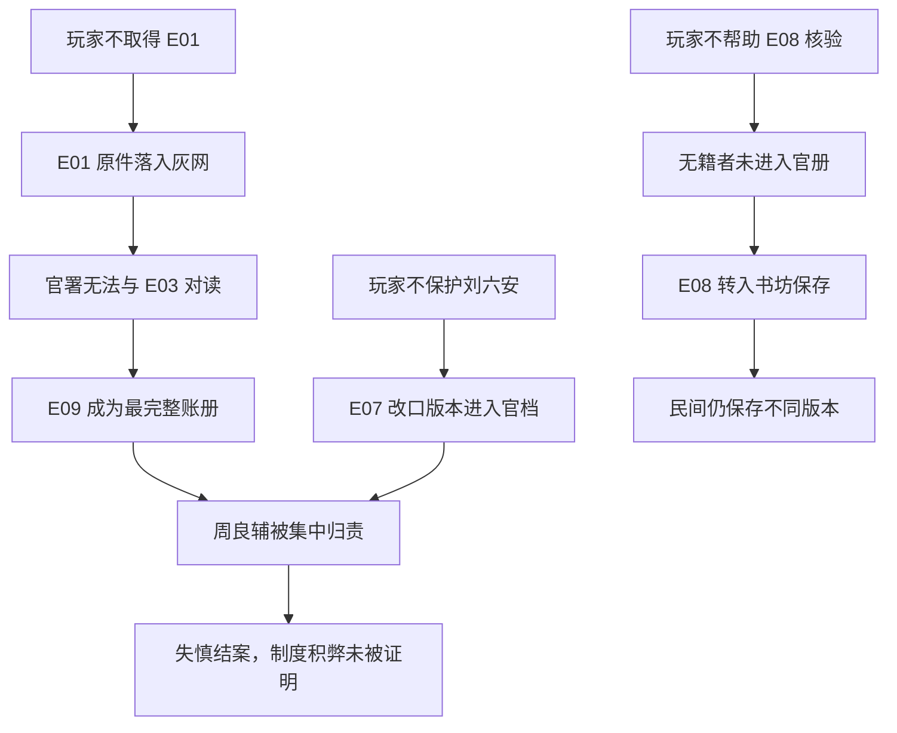

# 《天变邸抄：五月初六》无玩家干预纸面推演 v0.1

> 推演类型：T00 世界基线  
> 更新日期：2026-08-03  
> 输入文档：[主线大纲](./STORY_OUTLINE.md) · [证据矩阵](./EVIDENCE_MATRIX.md) · [人物小传](./CHARACTERS.md)

## 1. 推演目的

验证玩家完全不调查、不交易、不传播、也不帮助任何势力时：

1. 世界是否仍会自行推进；
2. 六方势力是否都有主动行动；
3. 证据是否发生转移、污染和失效；
4. 上层政治是否会在没有玩家材料时继续发展；
5. 第十四日是否能够产生官档、政治、民间和灾民四种不同记录；
6. 基线是否误写成真实历史定论。

## 2. 初始条件

- 玩家在序章脱困后退出调查，不救核心 NPC，不拾取 E01，不向书坊提供见闻；
- 世界使用固定历史锚点：灾变、奉旨查勘、优恤与修省、臣工陈言、尾声朝天宫灾；
- 所有具体证据、人物和十四日会勘期限为虚构；
- 不生成随机死亡，以便审计默认因果链；
- “失慎结案”只是本作虚构会勘的默认结果，不声称真实历史曾形成相同定案。

## 3. 逐日推演

### 第 0 日：灾变当日

**公开事件：**王恭厂一带发生灾变，街巷出现多种解释。

**人物行动：**

- 刘六安由普通救援者救出，但救援较晚，伤情与记忆状态恶化；
- E01 被唐小山捡到，他只认出是官样文书，没有立即交官；
- 叶春娘开始记录伤者和寻人姓名；
- 胡彦清开始做现场私记 E06；
- 周良辅躲入罗三槐控制的仓院；
- 余墨林收集到多个互相冲突的口述。

**状态变化：**E01 进入抄报网络；E07 初始可信度下降一档；E08 开始形成。

### 第 1 日：封锁与收拢

**公开事件：**奉命查勘救火，核心区封锁。

**人物行动：**

- 裴慎行收集 E02 和残存 E04；
- 梁进忠记录最早传播灾情的书坊与抄手；
- 罗三槐派人回收散落文书；
- 胡彦清请求延后清理一处位置，未获同意。

**状态变化：**现场证据窗口开始收窄；E06 部分位置关系永久丢失。

### 第 2 日：官册与民册分开

**公开事件：**灾损和死伤登记展开。

**人物行动：**

- 叶春娘将无籍租户、外来匠役和失踪者列入 E08；
- 官署要求提供可核身份，未立即采纳这些姓名；
- 刘六安向叶春娘说出第一版 E07；
- 唐小山把 E01 抄出一份，抄漏了一个表示存疑的旁注。

**状态变化：**E01 原件与抄件开始出现语义差异；E08 与官册形成结构性分歧。

### 第 3 日：三方取得不同残片

**公开事件：**官署要求上交民间捡拾的厂区文书。

**人物行动：**

- 唐小山将 E01 原件卖给罗三槐，向余墨林保留抄件；
- 裴慎行只从别处得到 E04 的部分册页；
- 郑怀朴取得 E03 抄件；
- 罗三槐确认 E01 可能与周良辅留下的副册有关。

**状态变化：**没有任何势力能完成三账对读；玩家缺席造成第一条重要机会关闭。

### 第 4 日：修省开启政治窗口

**公开事件：**修省、停刑等要求进入朝廷与官员讨论。

**人物行动：**

- 郑怀朴开始搜集能说明刑狱、税役与官署积弊的材料；
- 梁进忠要求余墨林不要刊出内廷和官员姓名；
- 余墨林同意暂缓，但要求保留灾区见闻；
- 刘六安被会勘人员第一次正式询问。

**状态变化：**上层政治在没有玩家证据的情况下仍然推进；E07 出现第二版本。

### 第 5 日：奸细说获得市场

**公开事件：**关于外敌奸细的说法扩散。

**人物行动：**

- 罗三槐通过中间人提供一份来源不明的外来人员名单；
- 梁进忠未确认名单为真，但允许巡缉先查其中两人；
- 沈惟实要求郑怀朴不要引用无法核实的名单；
- 胡彦清完成 E06 私记，但已无法补回第一日被清理的位置。

**状态变化：**错误叙事产生两名虚构外来者被拘查的现实后果；C07 尚未形成。

### 第 6 日：证人改口

**公开事件：**坊间开始接受“厂内失慎”作为最易理解的解释。

**人物行动：**

- 刘六安担心成为责任人，将“不合常例的操作”改称“临时调整”；
- 裴慎行认为新证词更适合行政记录；
- 叶春娘保留第一版证词，却没有渠道证明记录时间；
- 梁进忠安排刘六安暂住受控地点。

**状态变化：**E07 两版本并存，但官署只持有后一个版本。

### 第 7 日：第一份会勘初稿

**公开事件：**官署内部形成“火药失慎、责任待核”的虚构初稿。

**人物行动：**

- 裴慎行把周良辅列为账册重点责任人；
- 余墨林取得一份初稿摘要并开始扩充长文；
- 郑怀朴把 E03 当作军需混乱的个案，但缺少 E01 互证；
- 沈惟实保留“不能确认实物流向”的限定。

**状态变化：**官方、陈言和抄报三种文本首次分叉。

### 第 8 日：周良辅被放弃

**公开事件：**优恤名册即将进入核定阶段。

**人物行动：**

- 周良辅得知罗三槐准备把异常集中到自己身上；
- 罗三槐开始组织 E09；
- 叶春娘递交 E08，被要求删去无法核籍者；
- 郑怀朴希望引用更大的伤亡数字，沈惟实反对。

**状态变化：**周良辅开始补写 E10；灾民路线与政治路线产生第一次直接冲突。

### 第 9 日：名册窗口关闭

**公开事件：**官册接近封存。

**人物行动：**

- 叶春娘拒绝整体删除无籍者，导致 E08 未被完整采纳；
- 少量有双重证明的姓名由普通书吏补入官册；
- 梁进忠追查 E03 如何流入陈言网络；
- 余墨林将 E08 部分总数写入抄报，却没有逐一保留身份状态。

**状态变化：**部分现实优恤机会永久失效；E08 从行政材料转为记忆材料。

### 第 10 日：材料被政治化

**公开事件：**臣工陈言与君臣分歧扩大。

**人物行动：**

- 郑怀朴删去 E03 的部分限定，把“账面已领”写得接近“官物失窃”；
- 沈惟实拒绝为该段背书；
- 刘六安签下整理后的口供；
- 罗三槐完成 E09 的主体。

**状态变化：**正确的制度关切与过度确定的材料被捆绑，增加反驳风险。

### 第 11 日：假账进入核验

**公开事件：**一套完整账册被作为灾后寻回材料提交。

**人物行动：**

- 裴慎行发现个别格式异常，但因它能闭合大量缺口而暂不退回；
- 胡彦清发现会勘初稿只摘录 E06 中支持失慎的一部分；
- 罗三槐安排秦小乙离京，避免 E05 被继续追问；
- 周良辅准备带 E10 出逃。

**状态变化：**E09 获得“正在官署核验”的权威外观；E05 验证窗口关闭。

### 第 12 日：自陈被截

**公开事件：**各方开始准备最终文本。

**人物行动：**

- 周良辅出逃失败，E10 被罗三槐取得；
- 罗三槐不销毁 E10，而是把它作为控制周良辅的保险；
- 沈惟实向余墨林透露陈言材料存在过度表述；
- 梁进忠提出以不查禁换取书坊删除消息来源。

**状态变化：**C06 无人能形成；抄报版本得到一次纠偏机会。

### 第 13 日：副本分散

**公开事件：**会勘结论和抄报长文都接近定稿。

**人物行动：**

- 余墨林接受删除来源的条件，但把文本拆成多个副本；
- 唐小山为增强可读性加入更多奇异细节；
- 叶春娘把 E08 完整副本交给余墨林；
- 胡彦清把 E06 私记交给叶春娘，而非继续留在官署单一渠道。

**状态变化：**民间记录难以彻底消失，但事实等级进一步混杂。

### 第 14 日：基线定稿

**官署版本：**火药失慎，具体操作责任集中于已失踪的周良辅及已无法完整复核的厂内流程；长期制度问题未进入主结论。此为游戏虚构基线，不是历史定论。

**陈言版本：**灾变被用于说明刑狱、税役和朝政需要实质修省；因缺乏 E01/E10，军需积弊只作为含混例子。

**抄报版本：**保存大量现场与灾民信息，也混入无法互证的奇异见闻；E01 抄件存在，但限定语缺失。

**灾民版本：**E08 保存了官册外姓名，却未能让多数人获得当期优恤。

**灰网状态：**E01 原件、E10 和 E09 伪造过程仍受罗三槐控制；网络牺牲周良辅后继续存在。

### 第 15 日：朝天宫灾尾声

**史实锚点：**另一场火灾再次引发政治陈言。[S01][S07]

**游戏结算：**

- 郑怀朴认为第二场火证明自己的政治判断；
- 梁进忠认为这证明更应控制讹言；
- 余墨林把两场灾异编入同一文本；
- 裴慎行拒绝重新开启已经完成的会勘；
- 叶春娘继续补名，因为新的灾异并没有解决旧灾民的处境；
- 罗三槐借新的舆论焦点完成最后一批人员转移。

## 4. 基线因果链

## 5. 验证结果

| 验证项 | 结果 | 说明 |
| --- | --- | --- |
| 世界不等待玩家 | 通过 | 十五日内各势力均主动推进 |
| 六方势力均有行动 | 通过 | 每方至少三次改变证据或人物状态 |
| 大人物影响局势 | 通过 | 修省、优恤与陈言改变规则，不依赖直接会面 |
| 证据存在保管链 | 通过 | E01、E07、E08、E09、E10 均发生转手或版本变化 |
| 无单一万能证据 | 通过 | E10 也无法确认物理成因 |
| 官档与世界事实分离 | 通过 | 官署采用不覆盖底层证据状态 |
| 普通人具有独立目标 | 通过 | 名册与优恤线不依附爆炸成因调查 |
| 默认结局可追溯 | 通过 | 失慎基线由 E01 缺失、E07 改口、E09 入档共同造成 |
| 第 8～11 日行动多样性 | 有风险 | 文书事件偏多，需要加入至少一次现场追人或保护转移的可玩行动 |
| 玩家退出的叙事解释 | 未解决 | 正式游戏不能允许玩家“什么都不做”却无反馈，需要设计观察/等待界面 |

## 6. 推演发现的结构问题

### 6.1 E01 偶然性过强

如果玩家没捡到，唐小山恰好捡到并转卖，容易显得世界只为维持剧情而行动。

**修改建议：**序章明确表现多名拾荒者、差役和书坊抄手都在收集纸片；E01 只是其中一页，唐小山取得是公开可观察结果。

### 6.2 中段过于依赖文书

第 8～11 日连续发生名册、奏疏、口供和假账事件，容易重新变成“看日志”。

**修改建议：**至少加入两项空间行动：

- 护送或跟踪秦小乙离京，验证 E05；
- 在 E09 入档前追查补造账册的纸墨与印戳来源。

### 6.3 梁进忠的权力边界需要更清楚

如果他能随意拘人、封店和放行，会成为便利的剧情万能钥匙。

**修改建议：**将其能力拆成“提出要求、调用特定关系、承担一次人情成本”，所有正式拘押仍需通过巡缉或官署程序。

### 6.4 官署默认结论需要避免历史误读

“失慎结案”作为玩法基线很清晰，但玩家可能误以为这是真实历史最终定论。

**修改建议：**所有结局页明确标注“本局形成的文书版本”，历史资料库另列真实史料未能确定唯一成因。

### 6.5 灾民路线需要更早产生回报

若名册直到第 9 日才影响优恤，玩家可能把它误判为与主线无关。

**修改建议：**第 2～3 日即让一次姓名核实改变治疗、临时安置或遗体认领，不只等待最终银两结算。

## 7. 下一轮推演

建议按以下顺序继续：

1. T01：玩家把 E01 原件立即交官；
2. T02：玩家保留原件、把抄件交书坊；
3. T03：玩家优先帮助 E08 进入官册；
4. T04：玩家与罗三槐合作追查 E09 上层链条；
5. T05：玩家保护刘六安和周良辅，但不公开证词；
6. T06：玩家把未核查的奸细名单交给陈言网络；
7. T07：玩家严格区分事实等级，编成“最可信的孤本”。

每条路线应比较：官档结论、证人命运、灾民结果、文本流传、玩家暴露度和制度积弊证明度。

[S01]: ../research/tianqi/SOURCES.md#s01
[S07]: ../research/tianqi/SOURCES.md#s07
